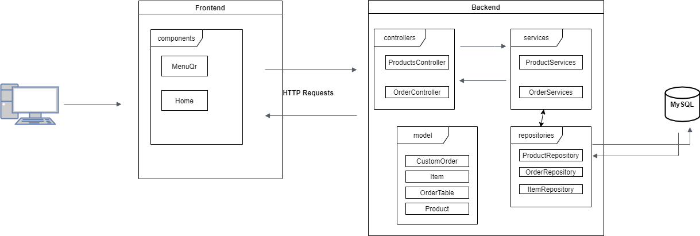

# Easyfood

## Repo del frontend para la aplicación Easyfood de la materia TIP para la Universidad Nacional de Quilmes.

### Sistema de gestión gastronómica para restaurantes, bares, pubs o venta al público en general.

#### Link a Trello : https://trello.com/b/zwPAP02o/

## Motivación

Dada la situación actual por la pandemia producida por el virus SARS-CoV-2 se presentaron diferentes necesidades para comercios gastronómicos los cuales necesitaban una manera de poder ofrecer sus platos y a la vez reducir el contacto e interacción que tenían los mozos con los clientes cuando querían realizar sus pedidos.

La problemática consiste en que evitar al mínimo el contacto con superficies, es por ello que los locales tuvieron que reemplazar el menú físico por uno virtual que se visualiza al escanear un código QR. Pero esto no era suficiente, ya que el mozo debía acercarse a las n mesas asignadas por turno para tomar el pedido y cobrar el total de la mesa, lo que hacía que se produzcan varios acercamientos sin poder conseguir un distanciamiento acorde en los establecimientos gastronómicos.

Con EasyFood queremos venir a solventar estos dos problemas: ofrecer un menú virtual el cual el cliente escanea un código QR, además que se capaz de autogestionarse su pedido y solicitar el cierre de la mesa.
Por otro lado el mozo tendrá visualización real del estado de las mesas, ya sea cuando están abiertas, cerradas y a cuales llevarles la cuenta.

## Arquitectura y tecnologías

### Arquitectura

La aplicación está dividida en dos grandes partes, por un lado tenemos un client web y por otra un servidor que manejará toda la lógica de negocio.
El cliente web permitirá visualizar los menúes a los clientes, visualizar las mesas a los mozos y además gestionar reportes para el encargado/a dueño/a. Todos estos pedidos estarán conectados al servidor el cual los recibirá y gestionará devolviendo la información solicitada.

El servidor web esta configurado para correr sobre localhost configurado en el puerto 8090 y el cliente web correrá sobre localhost pero en el puerto 3000. Para más detalle sobre como levantar cada módulo ingresar a su correspondiente repositorio
- [Frontend](https://github.com/Grupo5-TIP/frontend)
- [Backend](https://github.com/Grupo5-TIP/backend)

### Tecnologias

- React: para el frontend utilizamos ReactJS utilizando JavaScript, por su facilidad para crear elementos visuales y reutilizables.
- Spring: Como framework, que a pesar de su pequeña curva de aprendizaje, nos facilita el desarrollo de la aplicación dado por su facilidad para poder crear controllers con sus diferentes servicios y poder levantar y orquestar un backend con una mínima configuración como asi también con funcionalides que nos proveé (AOP, DI, contenedor web y abstracciones para acceso a los datos) simplificando la sintáxis.
- Maven: Como manejador de dependencias
- Java: Utilizamos Java como el lenguaje de nuestro backend por el conocimiento del mismo, su fácil integración con Spring y portabilidad cross SO por correr sobre una JVM.
- Bases de datos: Uso de H2 para almacenamiento de información.

## CI

- Uso de Travis en backend

## Entregas

Cada entrega costará de una wiki particular para poder mantener el orden

- [Entrega PoC](https://github.com/Grupo5-TIP/documentacion/wiki/Entrega-PoC)

- [Entrega Sprint 1](https://github.com/Grupo5-TIP/documentacion/wiki/Entrega-Sprint-1)

- [Entrega Sprint 2](https://github.com/Grupo5-TIP/documentacion/wiki/Entrega-Sprint-2)

- [Entrega Sprint 3](https://github.com/Grupo5-TIP/documentacion/wiki/Entrega-Sprint-3)

- [Entrega Sprint 4](https://github.com/Grupo5-TIP/documentacion/wiki/Entrega-Sprint-4)

- [Diagrama UML](https://github.com/Grupo5-TIP/documentacion/wiki/Diagrama-UML)

- [Diagrama de Arquitectura](https://github.com/Grupo5-TIP/documentacion/wiki/Diagrama-de-arquitectura)

| Miembros            | Github |
|---------------------|--------|
| Pablo Marrero       | (https://github.com/PabloGMarrero)       |
| Mariano Pais | (https://github.com/paismariano)       |
